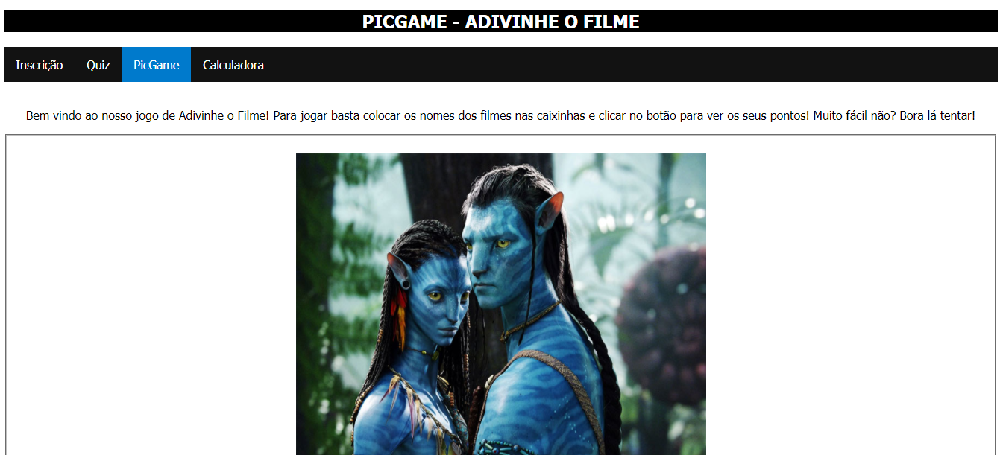

<h1 align="center"> 
  SCHOOL PROJECT 1
</h1>

 This website was built back in 2018 high school when I was in the IT course in Lisbon. 

  

## 📑 ABOUT THE WEBSITE
This simple project was my second website. I have no idea why I created the register page on this website and I kind of don't know what's the purpose of this website ... but honestly I think I was just doing things randomly to test my knowledge. 

The website was built with 4 pages. Inscrição, Quiz, PicGame and Calculadora pages.  
- The Inscrição page has registration formulary (?).  
- The Quiz page has a small random quiz game.  
- The PicGame page has a small game that the user is supposed to guess which movie is by seeing it's picture.
- The Calculadora page has a calculator 🤷‍♀️.

## 👩‍💻 USED TECHNOLOGIES
On this website I worked with:  
- HTML5.
- CSS3.

## 📌 POSSIBLE UPGRADES
I'm uploading this project on github because I think this is something I can work on to improve and practice my habilities so, possibly in my free times I'll be doing some updates on this website and on this case, since this project didn't have an original objective besides testing my habilities, I will bring a new idea for it. Probably will use one of the pages to rebuild this website.

---

## 💁‍♀️ Author
<table>
  <tr>
    <td align="center">
      <a href="https://github.com/laragraysse">
         
        
          <b>Lara Graysse</b>
        
      </a>
    </td>
  </tr>
</table>
